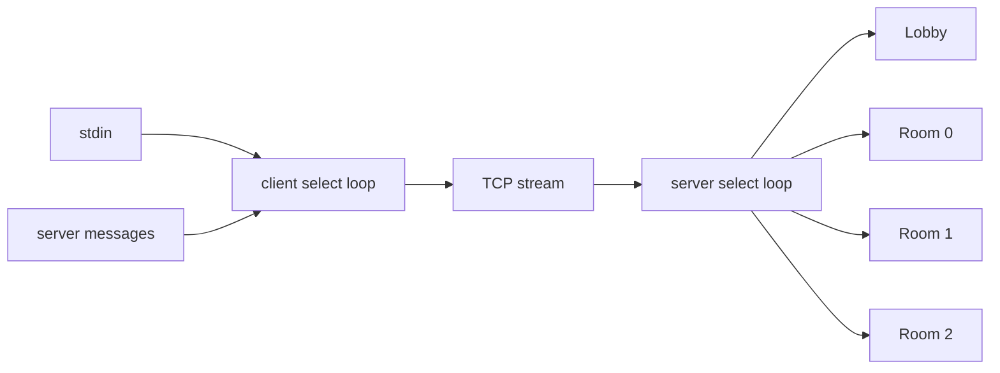
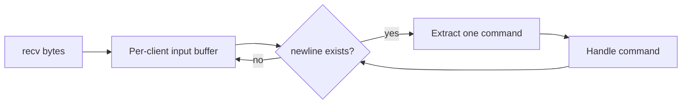

# C Network Programming: Multi-client Room Chat

[](https://github.com/Mindarinda47/c-network-room-chat/actions/workflows/test.yml)

2023년 컴퓨터네트워크 과제에서 경험한 TCP 소켓과 `select`를 바탕으로, 2026년에
TCP stream framing, partial send, 다중 클라이언트와 채팅방 상태를 독립 서버·클라이언트
구조로 다시 구현한 전공 기술 사례입니다.

## 15초 요약

| 해결 대상 | 2026년 구현 | 현재 검증 상태 |
|---|---|---|
| 여러 클라이언트 동시 처리 | 단일 `select` 이벤트 루프, 최대 15명 | 3-client Linux 통합 테스트 통과 |
| 로비와 채팅방 | 방 3개, 방별 최대 5명, 입장·퇴장·브로드캐스트 | 방 격리·브로드캐스트 테스트 통과 |
| TCP 메시지 경계 | 클라이언트별 수신 버퍼와 줄 단위 framing | 분할·병합 테스트 통과 |
| 일부만 전송되는 `send` | `send_all` 반복 전송 | socket pair byte 비교 통과 |
| 비동기 입력·수신 | 클라이언트에서 stdin과 socket을 `select`로 감시 | `-Werror` Linux build 통과 |

> **현재 상태:** GitHub Codespaces Linux 환경에서 `make test`를 실행해 warning-free
> build, protocol unit test와 3-client integration test 통과를 확인했습니다.

## 실행 구조



서버는 클라이언트마다 연결 상태, 참여 중인 방, 아직 완성되지 않은 입력 조각을 별도로
보관합니다. 따라서 하나의 `recv()`에 여러 명령이 합쳐지거나 하나의 명령이 여러
`recv()`로 나뉘어도 줄바꿈을 기준으로 올바르게 분리합니다.



## 기능

- `/list`: 채팅방별 현재 인원 조회
- `/join <0-2>`: 채팅방 입장
- `/leave`: 대기실로 이동
- `/quit`: 연결 종료
- 일반 문자열: 현재 채팅방의 다른 사용자에게 전달
- `SIGINT`·`SIGTERM`: 서버 종료 요청 후 열린 socket 정리

## 코드 바로가기

| 기능 | 구현 | 독립 검증 |
|---|---|---|
| 수신 조각 조립·분리 | [`protocol.c`](src/common/protocol.c) | [`protocol_test.c`](tests/protocol_test.c) |
| partial send 처리 | [`chat_send_all`](src/common/protocol.c) | socket pair byte 비교 |
| 다중 접속·방 상태 | [`server.c`](src/server/server.c) | [`integration_test.py`](tests/integration_test.py) |
| 비동기 클라이언트 | [`client.c`](src/client/client.c) | `-Werror` Linux build 통과 |

## 문제 발견과 보완

2023년 멀티서비스 과제의 실행 결과에서는 파일 다운로드가 완료된 것처럼 보였습니다.
송신 원본과 수신 파일을 byte 단위로 비교하자 두 수신 파일 모두 원본 뒤에 정확히
79바이트의 `EOF` 및 다음 메뉴 문자열이 추가되어 있었습니다. TCP가 `send` 단위의
메시지 경계를 보존한다고 가정한 것이 원인이었습니다.

이번 재구현은 제어 문자열 하나에 의존하지 않고, 클라이언트별 누적 버퍼에서 완성된
줄만 분리합니다. 전송 측에서는 `send`가 전체 데이터를 한 번에 처리한다는 가정도
제거했습니다. 자세한 근거는 [`docs/PROBLEM_SOLVING.md`](docs/PROBLEM_SOLVING.md)에
정리합니다.

## 빌드 및 테스트

Linux 또는 WSL에서 GCC·Clang 계열 C compiler와 Python 3를 준비합니다.

```sh
make clean
make
make test
```

수동 실행:

```sh
./build/chat-server 12345
./build/chat-client 127.0.0.1 12345
```

### 검증 결과

`make test`에서 `-Werror` build, protocol unit test와 3-client integration test가
통과했습니다. 같은 명령은 GitHub Actions에서도 실행되며, 세부 검증 항목은
[`docs/TEST_EVIDENCE.md`](docs/TEST_EVIDENCE.md)에 정리합니다.

## 현재 제한

서버는 학부 전공 사례의 범위에 맞춰 blocking socket을 사용합니다. 따라서 메시지를 읽지
않는 client의 송신 buffer가 가득 차면 `broadcast_room()`의 `send`가 event loop를 잠시
막을 수 있습니다. 실서비스로 확장할 때는 socket을 nonblocking으로 전환하고 client별
output queue와 writable event 처리를 추가해야 합니다.

## 학부 경험과 현재 구현

2023년 네트워크 과제에서 AF_UNIX·AF_INET socket, `fork`, `select`와 비동기 채팅 구조를 경험했습니다. 당시 최종 로비·채팅방 과제는 접속 초기 단계 이후 미완료였으며, 현재 저장소의 서버·클라이언트는 2026년에 TCP stream framing과 partial send 문제를 보완해 독립적으로 다시 구현한 결과입니다.

## 공개 범위

공개 저장소에는 이 README, 2026년 코드, 독립 테스트와 직접 작성한 설명만 포함합니다.
교수 제공 PDF·DOCX·예제·테스트·배포 리소스, 개인정보 포함 보고서, ZIP, 실행 파일,
원본 화면 캡처는 포함하지 않습니다. 로컬 비교용 `local-review/`는 `.gitignore`로
제외되어 있습니다.

- 프로토콜 설계: [`docs/PROTOCOL.md`](docs/PROTOCOL.md)
- 테스트 결과: [`docs/TEST_EVIDENCE.md`](docs/TEST_EVIDENCE.md)
- 출처 및 공개 범위: [`docs/COPYRIGHT.md`](docs/COPYRIGHT.md)
